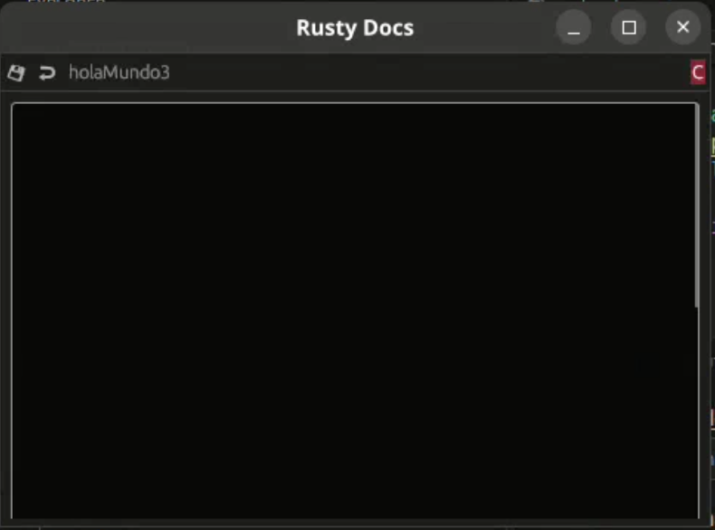
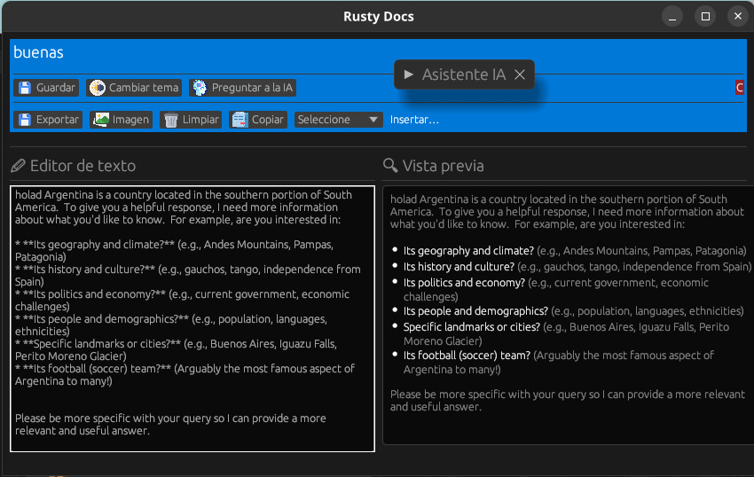
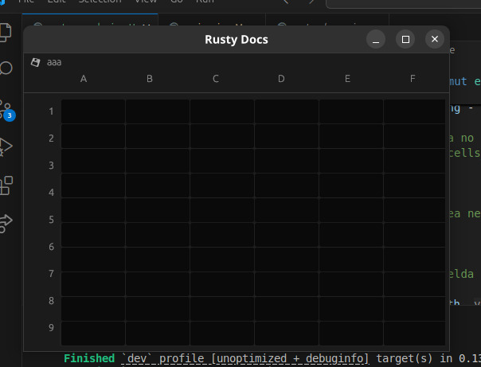
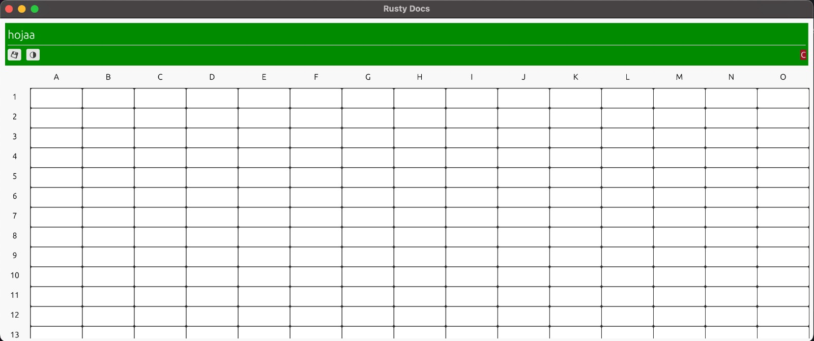
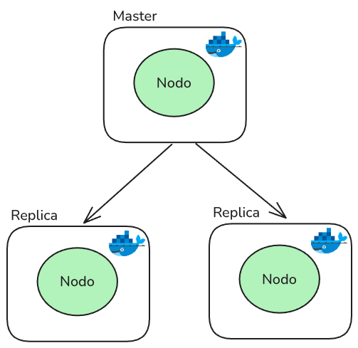

# Rusty Docs

## Introducción

**RustyDocs** es una plataforma de aplicaciones de ofimática que permite la edición colaborativa en tiempo real. Actualmente ofrece soporte para documentos de texto enriquecidos con asistencia de nuestra inteligencia artificial **MutodiniAI (Gemini AI)**.

<div align="center">
    
    
</div>

<div align="center">
    
    
</div>
## Dependencias

### Docker

Toda la infraestructura de RustyDocs se ejecuta dentro de contenedores, por lo que es **requisito tener Docker instalado**, ya sea en su versión Desktop o Engine:

- [Docker Desktop](https://docs.docker.com/desktop/)
- [Docker Engine](https://docs.docker.com/engine/)

<div style="text-align:center">
    
</div>

Además, asegurate de tener `docker-compose` instalado. Podés verificarlo con:

```bash
docker-compose -v
```

En caso de que no esté instalado, podés hacerlo con:

```bash
sudo apt-get install docker-compose
```

### Interfaz Gráfica

La interfaz gráfica fue desarrollada con la librería [egui](https://github.com/emilk/egui). Para ejecutarla correctamente, se requieren algunas dependencias del sistema operativo.

**En Ubuntu:**

```bash
sudo apt-get install -y libclang-dev libgtk-3-dev \
    libxcb-render0-dev libxcb-shape0-dev libxcb-xfixes0-dev \
    libxkbcommon-dev libssl-dev
```

**En Fedora Rawhide:**

```bash
dnf install clang clang-devel clang-tools-extra \
    libxkbcommon-devel pkg-config openssl-devel \
    libxcb-devel gtk3-devel atk fontconfig-devel
```

### Sin Docker

En caso de no utilizar Docker, simplemente instalá Rust en su versión más reciente para compilar y ejecutar los componentes de manera manual.

## Set up

El sistema está compuesto por **cuatro componentes principales**:

- Cluster de Redis  
- Microservicio de Control y Persistencia  
- Microservicio de AI  
- Interfaz Gráfica

### 1. Crear la imagen de Docker

Para compilar todos los componentes y generar la imagen `rusty_docs:latest`, ejecutar:

```bash
make build_docker_image
```

### 2. Levantar el Cluster de Redis

Una vez creada la imagen, se puede levantar el cluster completo con:

```bash
make run_docker_cluster
```

#### Levantar nodos individuales

En caso de querer levantar un nodo de forma individual:

```bash
NODE_ID=$NODE_ID NODE_PORT=$NODE_PORT CLUSTER_PORT=$CLUSTER_PORT make run_docker_single_node
```

- `NODE_ID`: número de ID según la configuración en `distributed_configs/`  
- `NODE_PORT`: puerto donde los clientes se conectarán al nodo  
- `CLUSTER_PORT`: puerto utilizado para comunicación entre nodos

### 3. Levantar los microservicios

Los microservicios de AI y Persistencia son esenciales para el funcionamiento de la aplicación, ya que brindan funcionalidades clave a la interfaz gráfica.

Para levantarlos, ejecutar:

```bash
make run_docker_microservices
```

Aclaracion, antes de realizar levantar los microservicios, asegurarse de que la API_KEY de Gemini este seteada en `25C1-MutoTodo-rs/microservice_llm.sh`.

### 4. Ejecutar la interfaz gráfica

La interfaz gráfica se inicia con el siguiente comando:

```bash
make run_ui
```

Durante el inicio se pedirá al usuario iniciar sesión. Los usuarios válidos están definidos en el archivo de usuarios utilizado por el cluster.

### Extra

En caso de querer eliminar los contenedores, ejecutar

```bash
make kill_docker_cluster
```

---

**Taller de Programación — Cátedra Deymonnaz — Facultad de Ingeniería, Universidad de Buenos Aires**

### Integrantes

- Aníbal Fu — 111206  
- Camila Figueroa — 111204  
- Giuliana Pazos — 111268  
- Tomás Villegas — 106456
